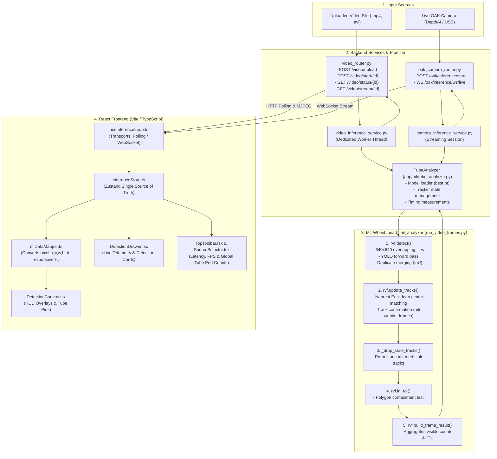

# Machine Learning Data Flow & Architecture

This document provides a comprehensive technical reference for how machine learning data flows through the Tube Detection system—from raw sensor/video frames and the underlying `head_tail_analyzer` wheel to the FastAPI backend services, REST/WebSocket APIs, and React frontend rendering.

---

## 1. High-Level Architecture

The system supports two real-time inference modes:
1. **Offline / Uploaded Video File Inference:** Processes local or uploaded video files frame-by-frame on a background worker thread, saving an annotated `.mp4` while streaming clean frames and live telemetry via REST and MJPEG.
2. **Live OAK Camera Stream Inference:** Ingests live frames from the Luxonis OAK sensor, runs real-time per-frame inference, and broadcasts live results over a WebSocket.



---

## 2. Core ML Wheel: `head_tail_analyzer`

All core computer vision and tracking logic is packaged in the standalone Python wheel:
`backend/app/ml/whl/head_tail_analyzer-0.1.2-py3-none-any.whl` (module: `head_tail_analyzer.run_video_frames` as `rvf`).

### Per-Frame Processing Steps in `TubeAnalyzer.analyze_frame(frame, frame_number)`:

1. **Tiled YOLO Detection (`rvf.detect`):**
   - The input frame (e.g. 1080p BGR) is divided into overlapping 640×640 pixel tiles (`tile=640`, `tile_overlap=0.2`).
   - The YOLOv8 model runs on each tile. Tile-local bounding boxes are projected back to full-frame coordinates.
   - `rvf.merge_duplicates()` merges overlapping detections based on `merge_iou` and `merge_contain`.
2. **Centroid-Based Tracking (`rvf.update_tracks`):**
   - Live tracks are matched to detections using nearest Euclidean center distance within `max_dist` (default: 80 pixels).
   - Roles are strictly partitioned: a `HEAD` never matches a `TAIL`.
   - Each track requires `hits >= min_frames` (default: 3 frames) to be marked `confirmed`.
   - Each track receives a persistent integer `id` (e.g., `1, 2, 3...`).
3. **Memory Cleanup (`_drop_stale_tracks`):**
   - Tracks that have disappeared for more than `max_missed` frames (default: 15 frames) without confirmation are discarded.
   - Confirmed tracks remain in memory so cumulative historical totals (`heads_total`, `tails_total`) persist accurately.
4. **Region of Interest (ROI) Filtering (`rvf.in_roi`):**
   - Tests whether each detection's `center` falls inside the polygon defined in `backend/app/ml/config/roi.json` using `cv2.pointPolygonTest`.
   - Detections outside the polygon are omitted from the current frame output.
   - When a track enters the ROI, `d["track"].in_roi_ever` is flagged `True`.
5. **Frame Summary Assembly (`rvf.build_frame_result`):**
   - Computes:
     - `heads_count`: Confirmed visible heads in this frame inside ROI.
     - `tails_count`: Confirmed visible tails in this frame inside ROI.
     - `heads_total`: Cumulative confirmed unique heads seen inside ROI across all frames.
     - `tails_total`: Cumulative confirmed unique tails seen inside ROI across all frames.
     - `detections`: Array of detection dictionaries.

---

## 3. Latency Measurement (`frame_time_ms`) & FPS Calculation

Latency is measured with microsecond accuracy using `time.perf_counter()` directly in `video_inference_service.py` and `camera_inference_service.py`:

```python
with inference_context():
    t_start = time.perf_counter()
    analysis = analyzer.analyze_frame(frame, frame_number)
    frame_time_ms = (time.perf_counter() - t_start) * 1000.0

infer_fps = round(1000.0 / frame_time_ms, 1) if frame_time_ms > 0 else 0.0
```

### What `frame_time_ms` Covers:
- Forward pass of the YOLO neural network across all tiles.
- NMS and tile duplicate merging.
- Track distance matching and state updates.
- ROI polygon containment tests.
- Result dictionary compilation.

### What It Strictly Excludes:
- Video frame decoding (`cv2.VideoCapture.read()`).
- Video writing to the output MP4 (`cv2.VideoWriter.write()`).
- JPEG stream encoding (`cv2.imencode()`).
- Thread hand-offs, asyncio event loop queuing, and network transport.

---

## 4. API Endpoints & Transport Protocols

### 4.1. Video File Inference API (`/video/*`)

| Endpoint | Method | Purpose | Response / Body |
| :--- | :--- | :--- | :--- |
| `/video/upload` | `POST` | Upload video file or register local file path | `{"session_id": "...", "status": "ready", "video_width": 1920, "video_height": 1080}` |
| `/video/start/{session_id}` | `POST` | Start offline/batch inference on the session | `{"status": "started", "session_id": "..."}` |
| `/video/status/{session_id}`| `GET` | Poll live inference telemetry and detections | Returns complete `InferenceStats` JSON (see below) |
| `/video/stream/{session_id}`| `GET` | MJPEG video stream of clean frames | Multipart stream (`image/jpeg`) |
| `/video/last_frame/{session_id}`| `GET`| Retrieve latest processed JPEG snapshot | Binary image (`image/jpeg`) |
| `/video/stop/{session_id}` | `POST` | Pause / stop active inference task | `{"status": "stopped"}` |
| `/video/clear/{session_id}`| `POST` | Delete temporary uploaded session files | `{"status": "cleared"}` |
| `/video/reset/{session_id}`| `POST` | Terminate task, release GPU, and drop session | `{"status": "reset"}` |

### 4.2. Live Camera Inference API (`/oak/*`)

| Endpoint | Method | Purpose | Response / Body |
| :--- | :--- | :--- | :--- |
| `/oak/start` | `POST` | Initialize Luxonis OAK camera hardware | `{"status": "started"}` |
| `/oak/stream/start` | `POST` | Start sensor capture stream | `{"status": "streaming"}` |
| `/oak/stream/stop` | `POST` | Stop sensor stream | `{"status": "stopped"}` |
| `/oak/inference/start` | `POST` | Start real-time AI pipeline worker thread | `{"status": "started"}` |
| `/oak/inference/stop` | `POST` | Stop real-time AI pipeline and release GPU claim | `{"status": "stopped"}` |
| `/oak/inference/ws/live`| `WS` | WebSocket streaming per-frame telemetry & frames | JSON stringified inference payload |

---

## 5. Data Schemas

### 5.1. Backend JSON Telemetry Payload

This payload is returned by `GET /video/status/{session_id}` and streamed over `WS /oak/inference/ws/live`:

```json
{
  "session_id": "1e550e2e-2e21-4f05-8968-356c9a33bb58",
  "status": "processing",
  "frame": 142,
  "frames_processed": 142,
  "total_frames": 900,
  "progress": 15.8,
  "fps": 68.2,
  "frame_time_ms": 14.66,
  "latency_ms": 14.66,
  "heads_count": 2,
  "tails_count": 2,
  "heads_visible": 2,
  "tails_visible": 2,
  "heads_total": 5,
  "tails_total": 5,
  "total_count": 4,
  "video_width": 1920,
  "video_height": 1080,
  "original_filename": "sample_tubes.mp4",
  "bigger_tube": null,
  "smaller_tube": null,
  "detections": [
    {
      "id": 1,
      "role": "HEAD",
      "class": "HEAD",
      "conf": 0.924,
      "confidence": 0.924,
      "bbox": [120, 340, 65, 70],
      "center": [152, 375],
      "status": "OK"
    },
    {
      "id": 2,
      "role": "TAIL",
      "class": "TAIL",
      "conf": 0.887,
      "confidence": 0.887,
      "bbox": [510, 342, 62, 68],
      "center": [541, 376],
      "status": "OK"
    }
  ]
}
```

### 5.2. Meaning of `detections[].bbox`

The `bbox` array uses standard pixel coordinates:
```text
[x, y, width, height]
```
- `x`: Top-left horizontal coordinate in original video pixels.
- `y`: Top-left vertical coordinate in original video pixels.
- `width`: Box width in pixels.
- `height`: Box height in pixels.

---

## 6. Frontend Ingestion & Canvas Mapping

### 6.1. Ingestion via `useInferenceLoop.ts`

- In **Video Mode**: `useInferenceLoop` issues fast periodic polls (`GET /video/status/{session_id}`).
- In **Camera Mode**: `useInferenceLoop` connects to `WS /oak/inference/ws/live`.
- Both pathways commit raw data into Zustand using `useInferenceStore.getState().setStats(data)`.

### 6.2. Responsive Percentage Mapping via `mlDataMapper.ts`

The React canvas is responsive and adjusts dynamically to any viewport size. `mapDetectionsToTubes()` converts raw pixel coordinates into relative percentages:

```typescript
const effectiveVw = data.video_width || 1920;
const effectiveVh = data.video_height || 1080;

const px = (d.bbox[0] / effectiveVw) * 100;
const py = (d.bbox[1] / effectiveVh) * 100;
const pw = (d.bbox[2] / effectiveVw) * 100;
const ph = (d.bbox[3] / effectiveVh) * 100;
```

Each detection is mapped to a `TubeEntity`:
```typescript
{
  id: "HEAD-1",
  displayId: "1",
  role: "HEAD",
  class: "HEAD",
  status: "OK",
  isAnomaly: false,
  confidence: 0.924,
  x: px,       // % from left
  y: py,       // % from top
  width: pw,   // % width
  height: ph   // % height
}
```

### 6.3. UI Element Connections

1. **Live HUD Overlays ([DetectionCanvas.tsx](file:///d:/tube_detection/frontend/src/components/DetectionCanvas.tsx)):**
   - Renders SVG / HTML bounding boxes directly over the clean video stream using `x, y, width, height` percentage coordinates.
   - Shows badge with ID and Role: `#1 HEAD 92%` or `#2 TAIL 89%`.
2. **Top Bar Telemetry ([TopToolbar.tsx](file:///d:/tube_detection/frontend/src/components/canvas/TopToolbar.tsx)):**
   - Reads `stats.frame_time_ms` (or `latency_ms`) to display `● LIVE  14.7 ms`.
3. **Global Tube Ends Counter ([SourceSelector.tsx](file:///d:/tube_detection/frontend/src/components/SourceSelector.tsx)):**
   - Displays real-time counts: `Heads: {stats.heads_count} • Tails: {stats.tails_count}`.
4. **Inference Details Drawer ([DetectionDrawer.tsx](file:///d:/tube_detection/frontend/src/components/DetectionDrawer.tsx)):**
   - Displays `Frame {frame}: HEADS={heads_count} TAILS={tails_count}`.
   - Renders scrollable detection list with confidence scores.
   - Shows processing progress bar and formatted uptime clock.
   - **Automatic Reset:** When inference is stopped or the video is cleared, resets immediately to the default standby card (`"Video Ready"` / `"Awaiting Tube Video Stream"`).
